# Collaboration in GitHub 

This material is based on a workshop by Matthew Hall from the University of Sheffield.

The aim of this chapter is to give an overview of one very popular method of collaborative working, version control and producing reproducable research. The authors use this method for all work they do (even when working on individual projects). We feel it is essential for the future of the field (and science in general).

We assume throughout that you have read previous chapters and have R & RStudio installed. The tutorial will use the RStudio Git GUI (basically an extra tab to use Git from within RStudio). If you don't already have RStudio on your computer, see Chapter 2.1 or install directly from here [https://www.rstudio.com](https://www.rstudio.com).

### Git

Git comes as a separate package for the main platforms. You might already have Git installed. If you don't, you can get packages for Windows and Mac from [http://git-scm.com/downloads](http://git-scm.com/downloads)

 
### Setting up RStudio

Before creating a project, RStudio needs to be configured to use Git. Open the Settings page in RStudio and make sure *Enable version control interface for RStudio projects* is checked. Ensure the *Git executable* field is populated. If it isn't, it needs to be set to the directory containing git. For Windows, this will be in `C:\Program Files (x86)\Git\bin\git.exe` if you used the package from git-scm.com. On Linux or Macs it should be in `/usr/local/bin` or `/usr/bin`.

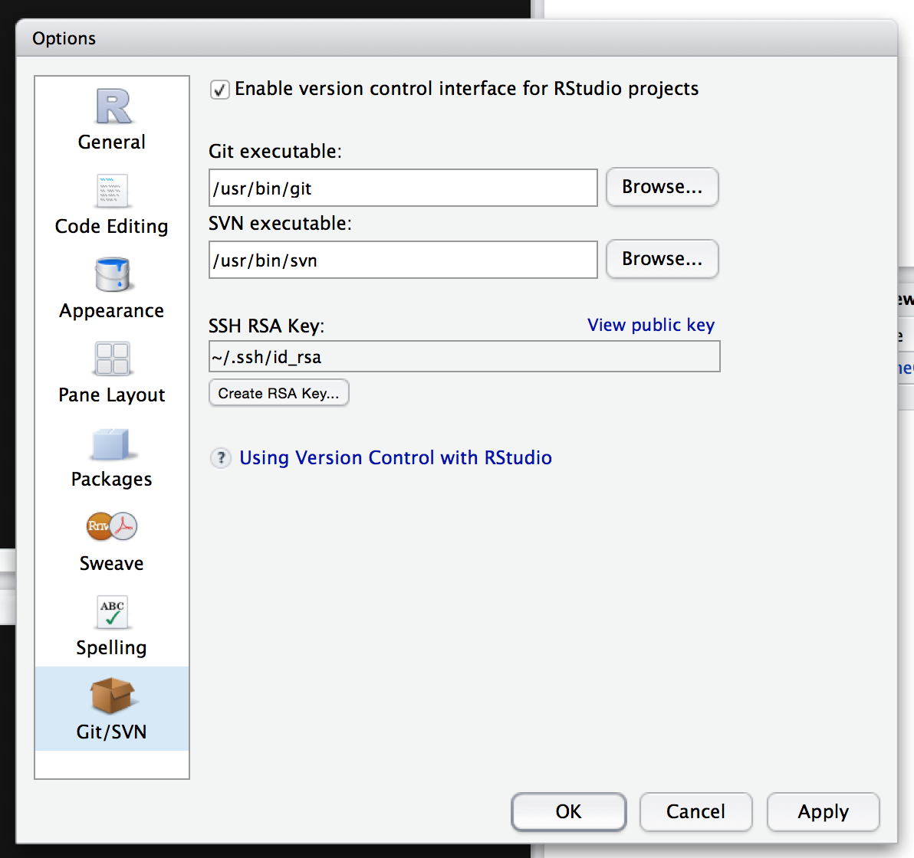

## Creating a Project with Git Integration

To start the tutorial, we'll go over the basics of checking in changes. To get started, we'll create an RStudio project. Create a project in RStudio in a new directory. Choose an empty project in the Project Type and make sure the *Create a git repository* option is checked.

## Adding a New File to the Project

Create a new R Script from the *New File* menu and give it a name. Add some code to the file and save it.

## Overview of the Git Panel

RStudio's Git integration consists of two components. The Git panel gives the overview of the files in your project. Clicking the *History* button (or the Diff or Commit buttons) brings up the detailed source control view.

### Empty Repositories

Git tracks the state of files by recording the changes. When you've made modifications to files, you can store those changes alongside a message. Git only tracks files that have been "added" to its own list of files it should track. When first started, Git won't track anything, so you'll have to add the files to git to track their changes.

This makes it easy to keep your repository cleaner: you only need to track the relevant files so temporary files or outputs won't "pollute" your commits.

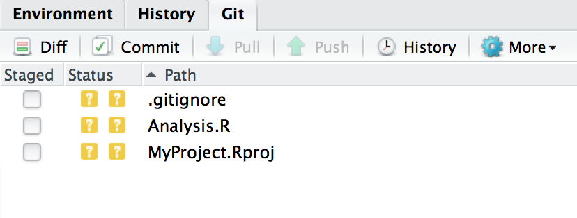

### Adding Files to Git

To set Git to record changes to files, add the file you created to it by checking the box next to its name in the Git panel. This "stages" the change (adding the file). A staged change isn't saved, but will be included when you commit. The file's status will change to an "A" to indicate that the file's addition will be included in your next commit.

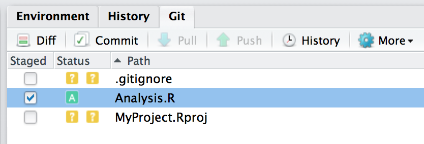

### Committing the Change

Click the commit button to show the commit editor. You can check the changes you're about to commit before giving your commit a message and clicking a commit button.

After committing your file, close the Git output window and the "Review changes" window to get back to the main RStudio interface.

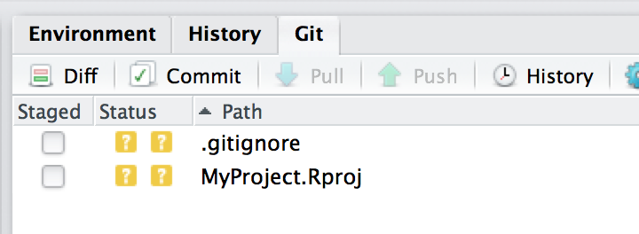

You'll see that your file isn't listed in the Git panel. This is because the file is now "clean"; it hasn't been changed since it was committed so there are no changes to stage.

Change the file and save it, and the Git panel will show that the file has been changed again.

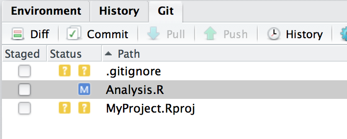

The file now shows up in the Git panel because it's been modified (M). You can stage these modifications by clicking the Staged checkbox.

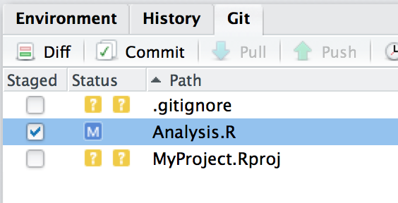

You can then commit the changes via the commit button again.

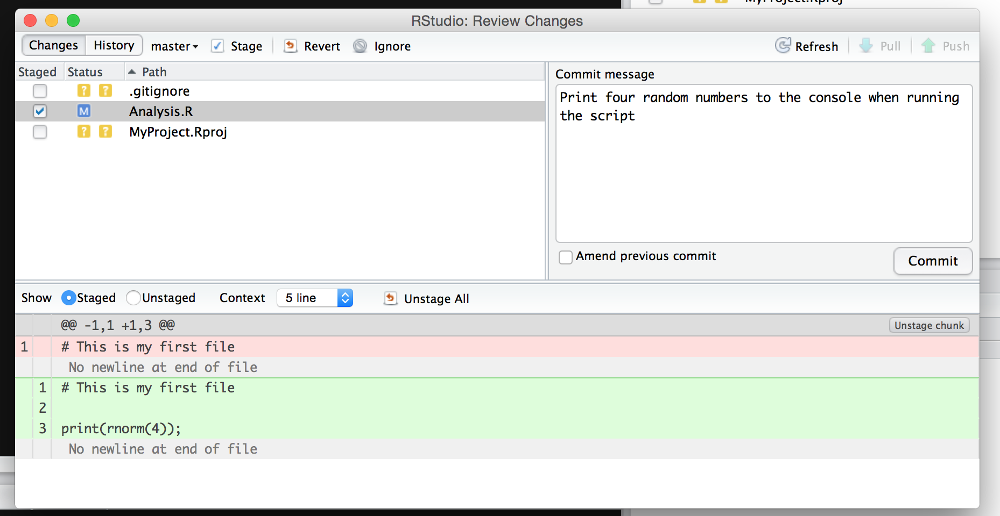

### Looking at Previous Revisions

The History button opens the Review Changes window that shows the history of commits made to the repository. 

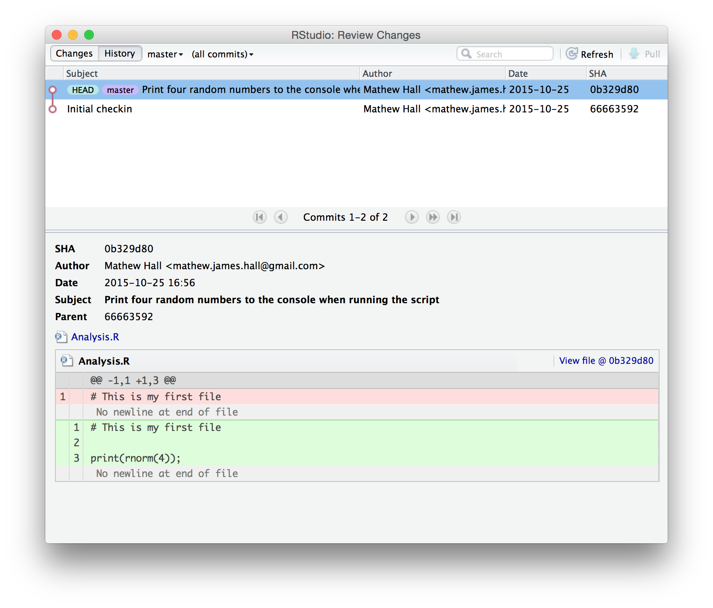

Selecting a commit will show the "diff" recorded by Git. You can also use the "View file @ (revision)" button to see how the file looked when it was committed. In RStudio, you can save this file elsewhere to retrieve old copies. *(Git provides more advanced features for dealing with (and changing) history but these aren't (currently) available from within RStudio.)*

#### Diffs

When you make a commit, Git stores them as a bundle of diffs against the previous file. That way, Git always has a full set of all the changes made to the file since its addition to the repository. Diffs consist of several chunks; each chunk is a part of the file that changed. 

A chunk itself is made up of added and deleted lines. Sometimes, these are easy to read. Other times, they get confusing to read. For example, if you swap two large blocks of code they may be recorded as two separate chunks. You can keep your diffs readable by making your commits as self-contained as possible.

### Git for Single Users

We've covered the basics of working with Git for single users: you now have enough experience to use it in your own projects without having to email/duplicate old copies to keep working revisions. Instead, just note the revision (the "SHA" from the Review Changes history tab) used to generate results and you'll always be able to go back and regenerate them.

Git repositories can exist on shared services like Dropbox. However, if you do keep a repository in such a service, make sure you only modify it from one machine at a time, and that the repository is fully synchronised before you make any changes.

## Collaborating with Git

If you work with multiple collaborators (or use multiple computers), you can use Git to make sure everyone has a current copy of changes and to resolve problems when multiple people change the same files.

It's possible to copy a repository from one location to another, and all the changes will be kept. Because the history of the repository is included when the copy is taken, Git is able to work out how files should look if people make different changes to their own copies then try to merge them back into a central copy.

### Cloning a Repository

To start working with an existing repository, you can clone it. This takes a complete copy of the remote repository, allowing you to go back in its history as you can with other repositories. The clone operation also remembers where the repository came from. If the remote repository changes, you can then pull changes back into your own copy.

### Pushing to a Repository

If you have permission, you can push any changes made to your local repository back to the remote. The tutorial will cover the basic process of making changes and publishing them.

### GitHub and BitBucket

GitHub provides a free service that allows you to host a repository and share it with the public (private access is available for a fee). BitBucket provides a similar service. These services serve your central copy, which other collaborators can clone, make changes to, then push commits to.

## Cloning a GitHub Project

For this exercise, we've set up a GitHub repository at [https://github.com/SheffieldR/git-workshop](https://github.com/SheffieldR/git-workshop). In this exercise, you'll use GitHub to "fork" the repository, add your name to the README.md file and submit a pull request. This is the normal flow for collaboration with 

### Getting a GitHub Account

To use GitHub, you'll need an account. You can sign up for one at [https://github.com/join](https://github.com/join). Once you have an account you can create repositories.

### Forking the Repository

When you want to contribute to a repository, you won't normally be allowed to send changes straight to it. Instead, you have to take a copy of the repository and make changes on the copy. Then, you ask the maintainer of the original repository to adopt your changes. This process is called "forking" because you're creating a fork in the project's timeline. The maintainer will then "merge" the two timelines back into one.

To fork our repository, visit [https://github.com/SheffieldR/git-workshop](https://github.com/SheffieldR/git-workshop) and click the "Fork" button. This will create a copy of the repository in your account. The repository will be recorded as a fork, linking to the original repository.

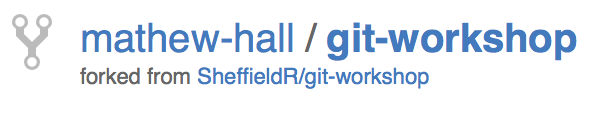

### Cloning the Repository with RStudio

To get started, create a new project in RStudio. This time, choose the "Version Control" option, then select the Git option.

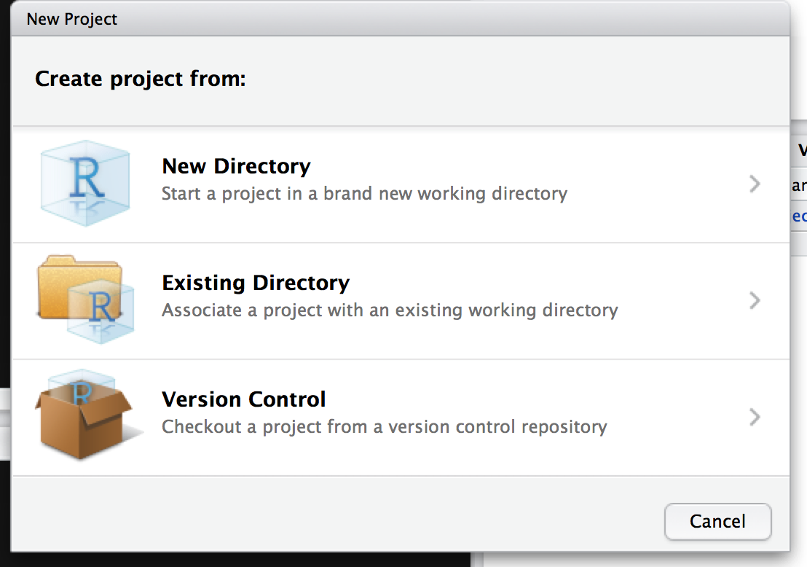

On your GitHub project fork, copy the "Clone URL" and paste it into the Git repository URL in the RStudio Git window.

Click the Create Project button to check out the remote copy.

### Making changes

Once RStudio has checked the project out, it will automatically generate a project file and `.gitignore` file. These files can be ignored for the exercise. Open the `README.md` file from the Files panel.

Make some changes to the README.md file and commit them using the Git panel, going through the same steps as before.

### Add a New R File (Optional)

If you wish, you can also add a new file and write some R code. Don't forget to add it to Git and save the changes.

### Pushing Your Changes

You're now ready to push your changes to your forked copy of the repository. First, open the History window from the Git panel.

The overview shows that your copy of the repository is ahead of the "origin" - you've made changes that aren't saved remotely yet. Close the Review Changes window and then click the Push button in the Git panel.

After some time, your changes are now available remotely on your fork. You can verify your push worked by checking the History in RStudio.

The "origin" and local histories are the same; the remote branch has "caught up" to your changes.

### Making a Pull Request

Go to your repository on GitHub. You should see your changes to the `README.md` file in the project overview.

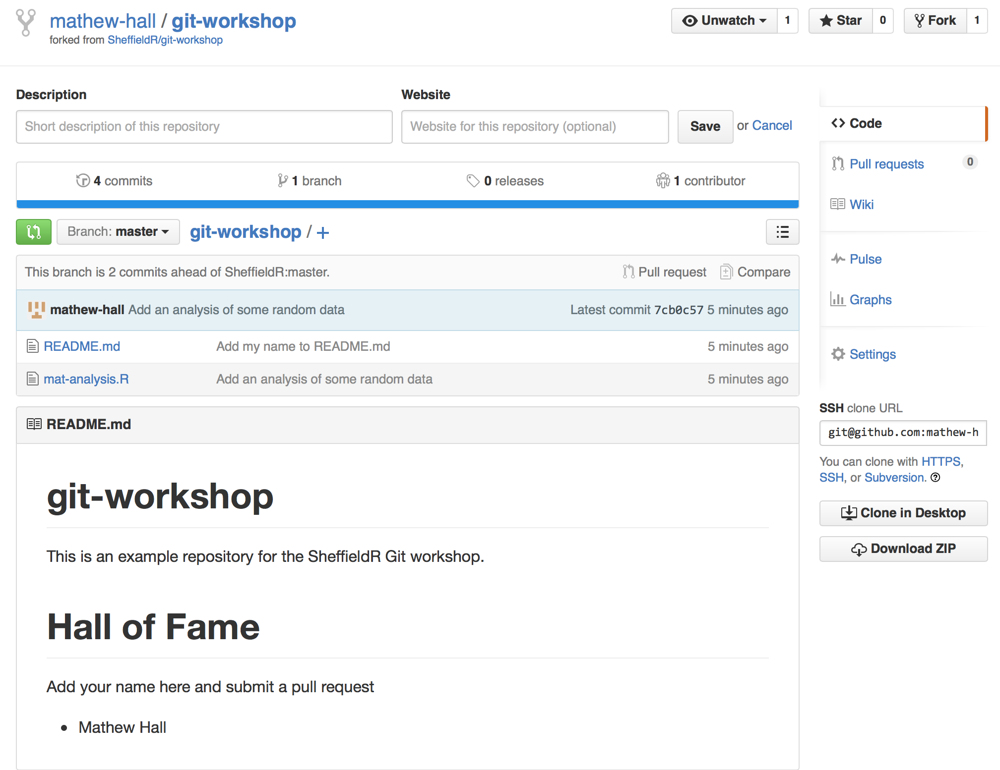

Click the "Pull Requests" link on the right hand side of the project.

Click the "New Pull Request" button to create a pull request for your changes.

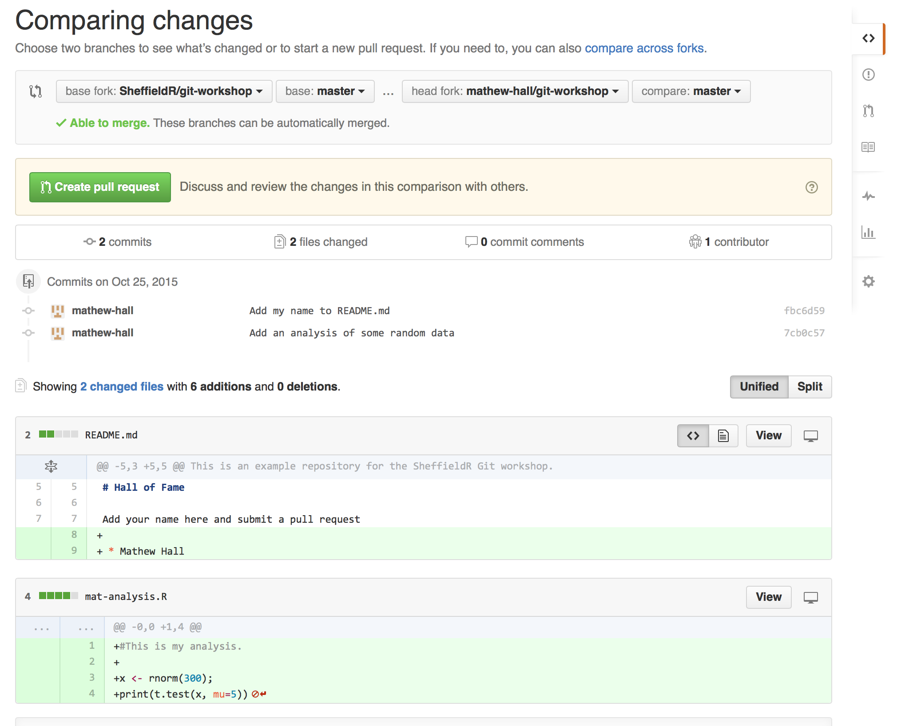

You'll see all the differences that you're proposing the maintainer integrates with the repository. Make sure you haven't accidentally included any superfluous files. If you're happy with the changes, click the "Make Pull Request" button.

You can now add a title and description that motivates your suggested changes.
